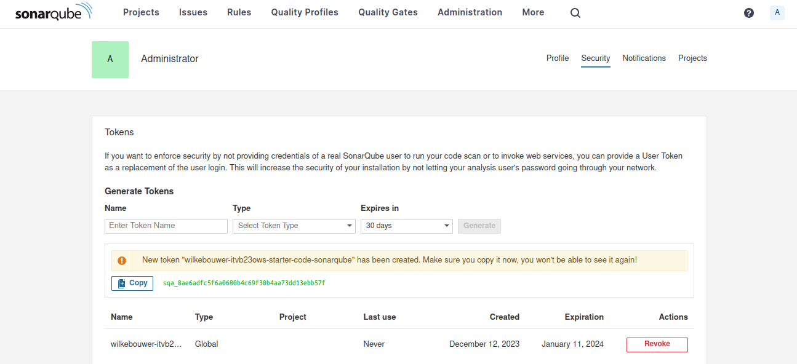
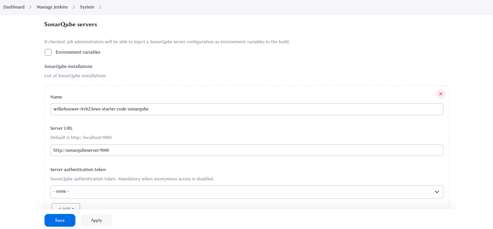
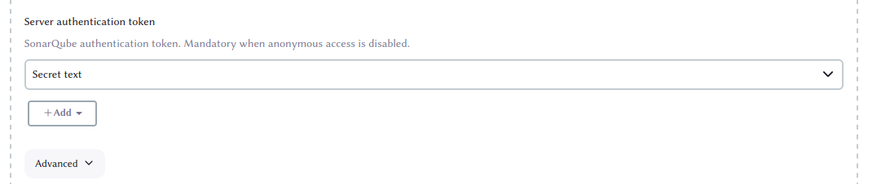

# ITVB23OWS Development Pipelines starter code

This repository contains starter code for the course ITVB23OWS Development pipelines,
which is part of the HBO-ICT program at Hanze University of Applied Sciences in
Groningen.

This is a deliberately poor software project, containing bugs and missing features. It
is not intended as a demonstration of proper software engineering techniques.

The application contains PHP 5.6 code and should run using the built-in PHP server,
which can be started using the following command.

```
php -S localhost:8000
```

In addition to PHP 5.6 or higher, the code requires the mysqli extension and a MySQL
or compatible server. The application assumes a root user without password, and tries
to access the database `hive`. The file `hive.sql` contains the database schema.

This application is licensed under the MIT license, see `LICENSE.md`. Questions
and comments can be directed to
[Ralf van den Broek](https://github.com/ralfvandenbroek).

## Running the application with Docker

The following commands should be run from the Git root.

### Production

To only the production containers, execute the following commands:

`cp .env-example .env`

If you want you can change environment variables in `.env`. Don't worry about the JENKINS.* and DOCKER_GID variables if you're planning to only run the production configuration. They can be kept unchanged.

`docker-compose build app database`

`docker-compose up app database`

The app should now be accessible from `http://localhost:APP_PORT/`

### Development

Setting up the development containers is a bit more involved. Included in the development setup is a tool for setting up development pipelines called Jenkins, which runs in a Docker container, but also needs the capability to run Docker containers from within the container. This is called Docker in Docker, and it requires some special configuration.

Instead of copying the `.env-example` file in the normal way, it's required to run the following command, which does it for you:

`sed "s/\(DOCKER_GID=\)/\1$(grep '^docker' /etc/group | cut -d':' -f3)/" .env-example > .env`

This command changes the `DOCKER_GID` variable to the GID of the docker group on your host system, because the docker group in the Jenkins container will need to match this GID as well for the configuration to work. This is because the dockerd socket from the host is used from within the Jenkins container through a volume. After running this command, you're free to change any other environment variable in `.env` you want.

After this, build and start all containers:

`docker-compose build`

`docker-compose up`

The app should now be accessible from `http://localhost:APP_PORT/`

#### Setting up Jenkins & SonarQube

Jenkins will automatically run a pipeline that checks if the production setup succesfully builds and runs on all branches, but it will fail because setting up the connection between Jenkins and SonarQube requires some more work. This is because SonarQube has limited automation functionality.

The first step is to set up a Global Analysis Token in SonarQube. SonarQube should now be accessible from `http://localhost:SONARQUBE_PORT/`, and this is where you'll need to go. From here, follow the instructions for changing your password, and this should drop you into the dashboard when succesful.

Select the account logo in the top right of the dashboard and select 'My Account'. From here, go to the security tab, and here you'll generate a new token with the name `wilkebouwer-itvb23ows-starter-code-sonarqube`, with the type Global Analysis Token. This token will allow Jenkins to get access to SonarQube. Press 'Generate', and copy the token. You'll need it after this.



After having copied the token, go to the Jenkins dashboard. We will now let Jenkins use the token. Jenkins should now be accessible from `http://localhost:JENKINS_PORT/`, using the credentials `JENKINS_ADMIN_ID` as username and `JENKINS_ADMIN_PASSWORD` as password. On the left side of the page, select 'Manage Jenkins'. Select 'System', and scroll down to where you see 'SonarQube Servers'.



In here, you'll set the server authentication token. Press 'Add', select 'Jenkins', set the 'Kind' to 'Secret text', and paste the copied token in 'Secret'.




Now press 'Add', and 'Save'. After this you should be able to run the pipeline succesfully.
